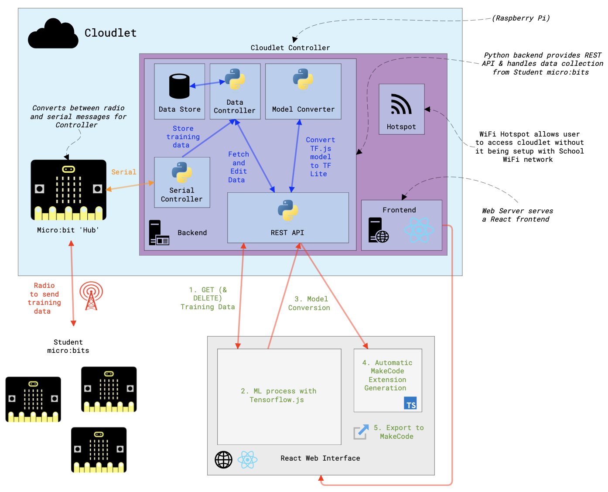
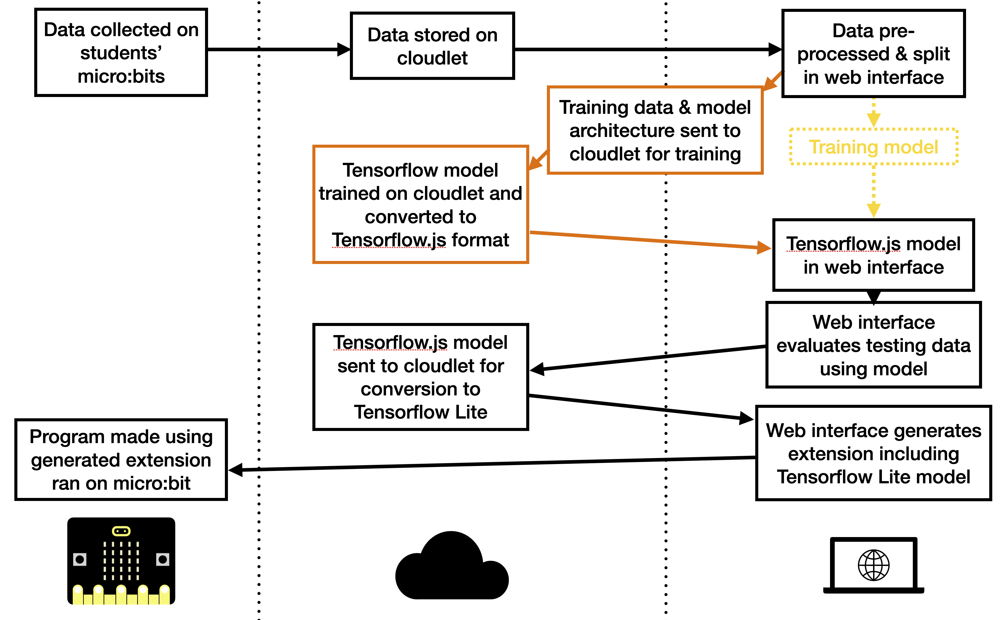
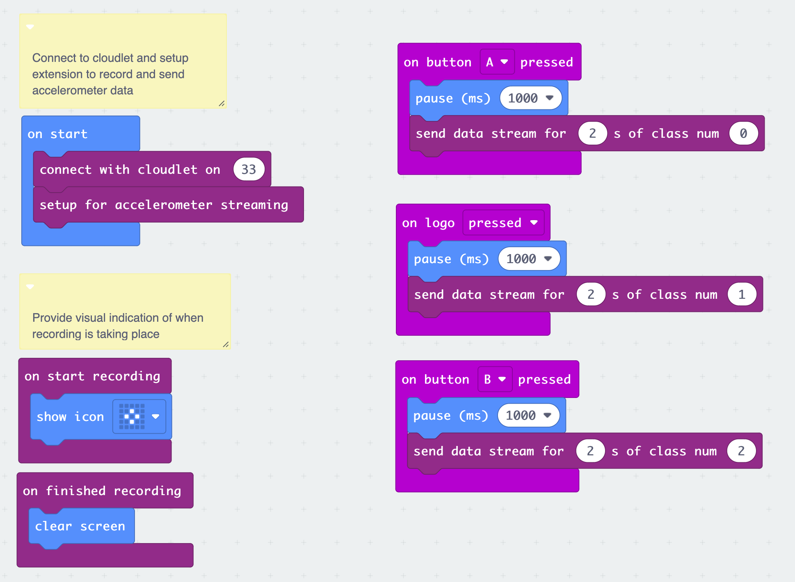
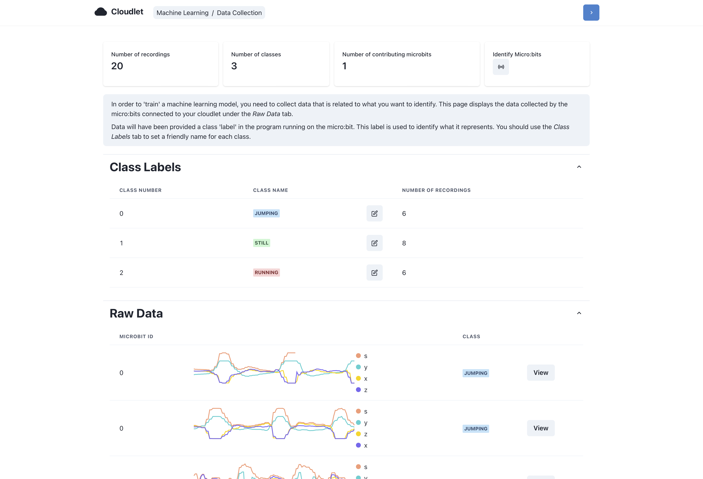
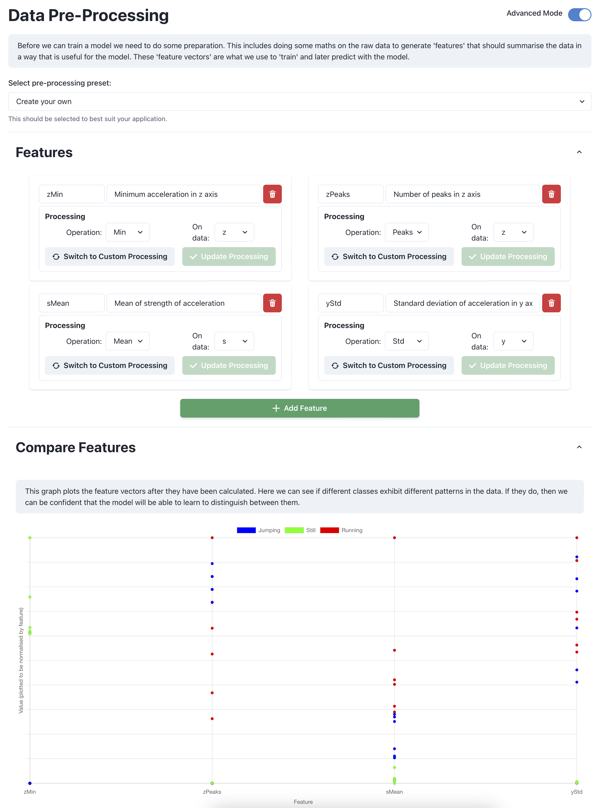
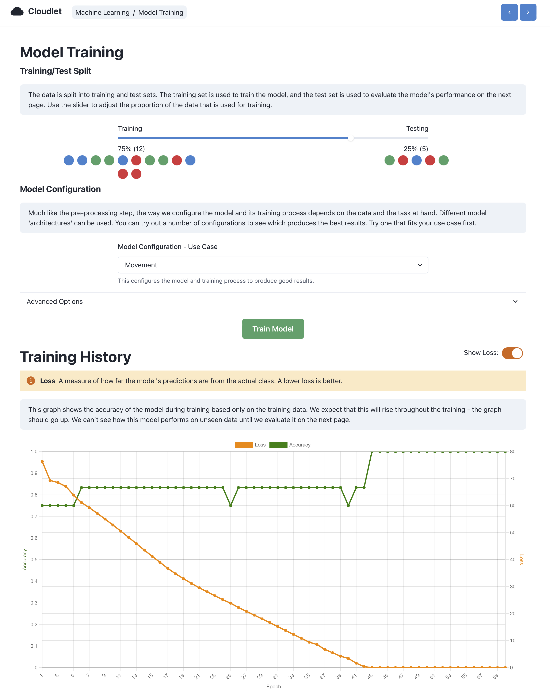
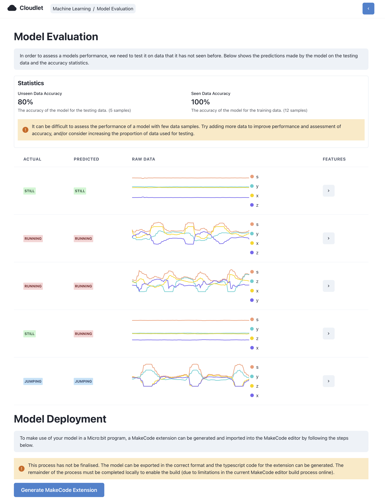
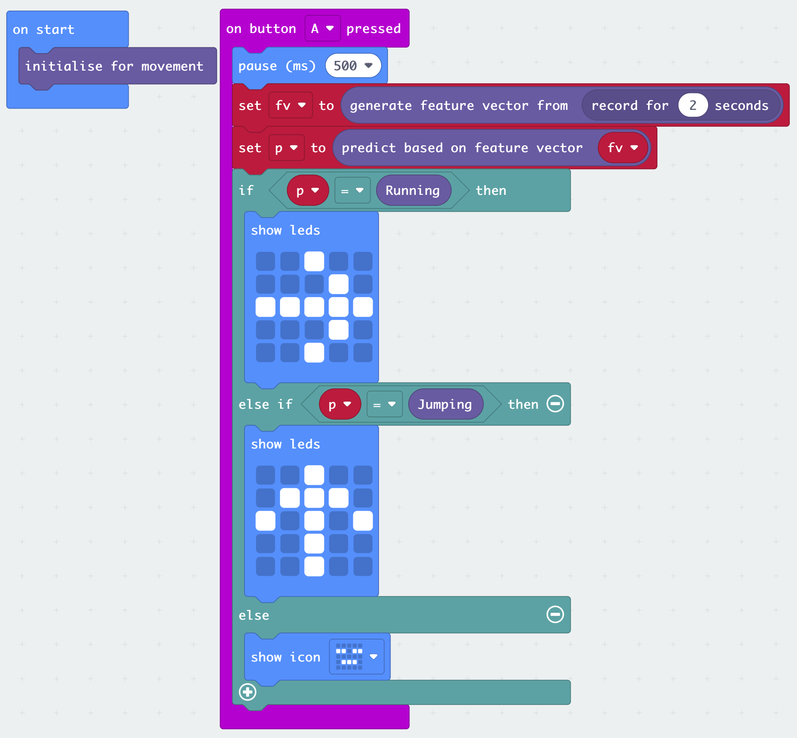

# Cloudlet-AI
Repo documenting and linking to my dissertation developing an platform to train ML models in the browser and deploy to micro:bit v2 for on device inference through a MakeCode extension

This work builds upon the work by Lorraine Underwood *et al.* with their classroom cloudlet project found [here](https://dl.acm.org/doi/abs/10.1145/3585088.3594487).

# Images

This README will be documented properly. In the meantime, here is a spam of diagrams and screenshots demonstrating the project!

